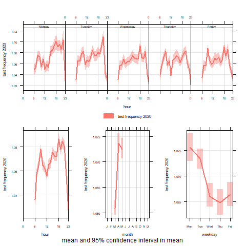
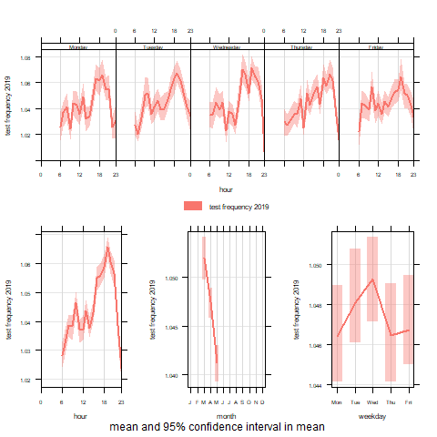

```{r settings, include = FALSE}
library(ggplot2)
library(tidyverse)
library(geojsonio)
library(tsfeatures)
library(rprojroot)
library(openair)
library(reshape2)
library(lubridate)
library(rgdal)
library(maptools)
library(sp)
library(rgeos)
library(classInt)
library(RColorBrewer)
library(knitr)
library(rprojroot)
library(viridis)
library(hrbrthemes)
library(stargazer)
library(png)

# This is the project path
path <- find_rstudio_root_file()
```

# Introduction {#sec:1}

During the pandemic, working from home using digital technologies, whether partially
or exclusively, was transformed from a niche means of accessing work, albeit one that
had been on a slow, upward trend, to a widespread way of life in many countries.
The ability to work from home or telecommute meant millions retained their jobs and,
to a varying extent, maintained productivity during periods of strict lockdowns 
around the world.
However, this ability has not been evenly distributed socially or spatially,
creating new intersections of economic and digital divisions.
On one side are those who can work from home, supported by digital technologies,
and have thus been able to enjoy both economic resilience and greater personal safety.
On the other side, previously employed individuals have been forced to accept
furlough or redundancy packages unless they are part of the cadre of essential
workers, who are potentially at high risk of infection.
Whilst the basis for this pandemic-generated divide has been viewed as mainly
occupational, here we consider whether it is also technological and geographical.

<!-- capability to WFH -->
The capability to work from home has previously been studied from the
perspective of whether work tasks in a given occupation both can be and are
allowed to be performed using digital technologies independently of
location or co-location with colleagues, including supervisors
[@allen2015effective; @singh2013modeling]. However, successful telecommuting also 
requires that the quality and reliability of digital services, particularly home 
internet connection speeds, enable the completion of work tasks with a minimum of 
delay or interruption. High levels of demand are one of the main causes of reduced 
reliability and slower connection speeds, as network bandwidth becomes congested. 
Yet prior to the pandemic, the performance of broadband services with respect to 
telecommuters was never tested at scale, as working from home and connecting to 
colleagues and workplace resources via the internet was the purview of a small 
minority of workers. Instead, leisure use in the evening, when video streaming 
services are at their peak, has been used to benchmark broadband performance and 
service delivery by different Internet Service Providers (ISPs) [@ofcom2017].

The shift towards telecommuting during various stages of lockdown around the world
has been drastic and there are speculations that post-Covid, the tendency to work 
from home will be much higher, raising questions around whether internet
services can accommodate the increased demand.
For example, $47$% of people in employment in the UK worked solely from home in April
$2020$, whilst the same figure only reached $5$% the year before [@ons2020; @ons2020lm2019].
Similar figures have been reported for other countries [@felstead2020homeworking].
Approximately $37$% of the European workforce worked from home in April $2020$ with
countries like Finland reaching $60$% [@eurofound2020].
In the US, almost half of the working population worked from home during the same
period because of the pandemic [@brynjolfsson2020covid],
and a recent estimate indicated that $37$% of all jobs in the US can be permanently
performed entirely from home [@NBERw26948].
None of these changes could have happened in the absence of reliable information
and communication technology (ICT) infrastructure -- both in terms of software
and hardware.
But while software innovations are easily diffused across space and
society^[See for example the huge success of videoconferencing apps such as Zoom
[@marks2020zoom].], the same does not apply for ICT hardware infrastructure such as
internet broadband connectivity.

<!-- our approach -->
Using the UK as a case study, this paper aims to understand how the quality and
reliability of internet service, as reflected in *experienced* internet speeds
during the spring 2020 lockdown,
may reinforce or redress the spatial and social dimensions of digital divisions.
We employ volunteered geographic data on individual broadband speed tests
and state-of-the-art time-series clustering methods to create clusters of UK local
authorities with similar temporal signatures of experienced internet speeds.
We then associate these clusters of local authorities with their socioeconomic
and geographic characteristics to explore how they overlap with or diverge from
the existing economic and digital geography of the UK.
As the quality of internet infrastructure and services, as well as the concentration
of different occupations are spatially dependent and clustered in space,
our approach offers a framework for understanding the impact of and interactions
between digital divisions geographically and socioeconomically.
Our analysis enables us to better understand how the spatial and social distribution
of occupation and online accessibility intersect to enable or hinder 
the practice of telecommuting at a time of extreme demand.
We also consider what lessons can be learned from this time for a future where
telecommuting is likely to remain a more common means of accessing work,
at least in comparison to the pre-Covid era.

By asking how resilient broadband speeds, and particularly upload speeds, are as
experienced in different parts of the UK during a time of extreme demand,
we interrogate which places benefit from the greater economic resilience
digital technologies can offer.
The structure of this paper is as follows.
First we review the literature on telecommuting and digital divides to better
understand their structural and spatial development pre-pandemic,
and thus their importance to the economic resilience of different places.
We then describe our data and methodology.
Our results section first offers a classification of how internet services vary
across clusters of UK local authorities and then assesses whether these clusters
replicate or repudiate other socio-economic and geographic patterns of economic
resilience.
We conclude with a discussion of the insights we have gained from our new
perspective on digital divisions.

# Literature review {#sec:2}

## From telecommuting to #WFH {#sec:2.1}

<!-- Who works from home-->
In this analysis, the terms 'telecommuting' and 'working from home^[See also the popular social media hashtag #WFM]' 
are used interchangeably, as most remote labour during the Covid-19 crisis was carried 
out in the homes of individual employees rather than any other location [@eurofound2020].
However, previous research has explored how telecommuting
can occur in other places, including satellite offices or on public transport
[@felstead2012rapid; @siha2006telecommuting].
Previous research has also used a variety of definitions to measure the level of
telecommuting within different workforces, distinguishing between those
directly employed, indirectly employed, self-employed, full-time or part-time, and
those who use digital technologies to work remotely full-days or part-days
[@allen2015effective; @bailey2002review; @haddad2009examination].
No matter the definition, the option and capability to telecommute or work from home
has never been equally distributed spatially or socio-economically any more than
different industries and employment opportunities have.
Studies from the United States, the Netherlands, and the UK found
that telecommuters are most likely to hold professional, managerial, and technical
occupations where the workforce is better educated and wealthier, and that there is
suppressed demand among women and part-time workers
[@headicar2016move; @peters2004employees; @singh2013modeling].

Opportunities for working from home during the current pandemic have likewise not
been equally spread across the workforce.
@NBERw26948 indicated that in the US, managers, educators, those
working in computer-related occupations, finance, and law can easily work from home,
and that occupations with opportunities to telecommute are associated
with higher earnings.
This is not the case for the workforce occupied in more spatially fixed occupations,
from farming, construction and manufacturing to hospitality and care services.
In the US, these occupations tend to be lower-income, non-white,
without a university degree, live in rental accommodation and lack health insurance
[@NBERw27085].
Similar trends can be observed for other countries.
For example, $75$% of workers with tertiary education worked from home in Europe
during spring $2020$, whilst only $34$% of workers with secondary education and
$14$% of those primary education did so [@eurofound2020].

## Digital divides and economic resilience {#sec:2.2}

<!-- WFH and digital divides-->
The literature describes first level digital divides in terms of the
availability and quality of internet connectivity, such as that manifest in
different geographies in the UK [@riddlesden2014broadband; @philip2017digital].
Second level digital divides consider the presence or lack of the necessary skills
to effectively utilise digital technologies and the internet
[@blank2014dimensions; @van2011internet].
The third level focuses on the heterogenous returns of internet usage among
different socioeconomic groups and, consequently, how digital technologies can
assist in bridging or further enhancing existing socioeconomic divides.
[@stern2009levels; @van2014digital; @van2015third].
The capability to telecommute is related to all three levels of digital divides,
but more importantly leads to differentiated outcomes regarding the economic
resilience of people and places to overcome a systemic shock such as the current
pandemic.

Our understanding of telecommuting as a product of enabled occupations can be
described as a manifestation of the third level digital divide, as those who are able
to use digital technologies to work from home benefit from a high rate of return on
their use of the internet in terms of autonomy, flexibility, and time saved from
commuting [@peters2004employees; @siha2006telecommuting; @singh2013modeling].
In some aspects, these returns may have increased during the Covid-19 crisis,
when those with the capability to telecommute also have the ability to maintain
their employment whilst protecting their health.
However, the success of these arrangements has been dependent upon the first
level digital divide, which is associated with access to and quality of internet
connectivity.
@SALEMINK2017360 provides a systematic review of the pre-pandemic,
first level digital divide in infrastructure quality between urban and rural areas
in various advanced economies. Rural areas, predictably, fare worse.
This finding broadly applies in the UK, where studies that also analysed broadband 
speed checks concluded that average speeds are lower in rural areas, something that
has not been improved by policy measures to increase competition [@riddlesden2014broadband; @nardotto2015unbundling].
In contrast, @riddlesden2014broadband found that levels of deprivation did not 
correlate with first level digital divides.

However, as @blank2018local highlight, variation in individual internet 
availability and uptake is a product of more complex spatial and 
demographic characteristics than simple rurality or urbanisation.
Dense urban areas were shown to suffer more from slowdown during peak hours, 
although these services were more likely to be improved by increased competition 
between providers, such as between new entrants and Virgin Media cable connections
[@riddlesden2014broadband; @nardotto2015unbundling]. The latter were historically 
available to only $45$% of premises in the UK [@ofcom2016], where the more
lucrative and competitive market originally attracted the cable TV provider. 
Whether the variation in infrastructure quality and reliability affects the 
spatial footprint of telecommuting has not previously been investigated, in part 
because telecommuting has not previously been a cause of concentrated demand and 
pressure on internet services. 

Other intersections between digital divides have been subject to study.
There are indications that those who purchase high speed connections consume
more data of all sorts and use their connections for a greater variety of purposes
[@hauge2011consumer].
There is also a correlation between access to internet services and a
reduction in household transport spend [@bris2017ict].
These studies suggest that better internet services enable households to make 
savings and efficiencies, an example of the first level digital divide reinforcing 
the third level. Such digital intersections and efficiencies have also changed 
transportation, connectivity and the structure of cities during the pandemic.
We now have enough data to confirm the drastic alteration observed in the space-time 
geography of cities around the world in the last year [e.g. @google2020; @shibayama2021impact]. 
Yet, although there is a broad agreement that these changes 
during the pandemic have played a pivotal role in stopping the spread of the virus 
[@jia2020population; @yang2020taking; @mu2020interplay], the extent to which the 
increased levels of working from home, the consequent decrease in commuting flows, 
and the altered structure of cities will remain post-pandemic is the subject
of considerable debate in the literature. 

<!-- Covid-19 and working from home, cities, urban structure -->
Meanwhile, multi-layered digital divides may also intersect with material divides
and the economic geography of the UK.
The regional economic resilience literature underlines the differentiated capacity 
of cities and regions to escape or recover from economic crises 
[@martin2012regional; @kitsos2018economic].
As different places have different industrial and occupational profiles, 
these affect their aggregated potential capacity for telecommuting.
Such profiles are associated with longstanding inequalities in the UK and their
spatial representation as a North-South divide [@martin_north_south].
Various studies have illustrated severe inequalities between the north and the
south regions of England in terms of skills and human capital,
unemployment, productivity and prosperity [@lee2014grim; @mccann2020perceptions;
@dorling2018peak].
Some scholars have even argued that the UK suffers from some of the highest levels of
interregional inequalities in the global north [@gal2018reducing; @mccann2016uk].
All three levels of digital divides are associated with or shaped by the
geography of the UK. Yet this is the first time that the intersection of digital 
and material divides is relevant to understanding the economic resilience of places 
and large swathes of the population, as digital technologies became an essential
tool of productivity during the Covid-19 pandemic.

The extreme demand during the pandemic thus provides a new opportunity to understand
how internet infrastructure quality, and reliability affects telecommuting, 
particularly in light of the high volumes of bandwidth-intensive 
video conferencing required in order to avoid the face-to-face contact that could 
increase the spread of infection.
We seek to answer how internet service resilience could contribute to or reduce 
economic resilience when the latter is dependent upon the capability to 
work from home.
We also aim to improve our understanding of the impact of first level digital
divisions on telecommuting, and whether this results in more fundamental third
level digital divisions than has previously been perceived.

# Methods and data {#sec:3}

## Time-Series clustering {#sec:3.1}

<!-- clustering in general -->
Our chosen methodological framework is cluster analysis, which can
be defined within machine learning approaches as an unsupervised
learning task, partitioning unlabelled observations into homogeneous groups
known as clusters [@montero2014tsclust].
The key idea is that observations within clusters tend to be more similar than
observations between clusters.
Clustering is particularly useful for exploratory studies as it identifies
structures within the data [@aghabozorgi2015time].
Cluster analysis is a widely used in geography
[@gordon1977classification; @everitt1974cluster], for example to solve 
*regionalisation* problems [@niesterowicz2016].
Clustering methods are also the basis of *geodemographics*, a research
domain which aims to create small area indicators or typologies of neighbourhoods
based on diverse variables [@SINGLETON2009289; @harris2005geodemographics].
These studies usually employ cross-sectional data, and most clustering problems in 
geography deal with observations that are fixed in time.
However, for this paper we are interested in internet speeds, which vary over time.
Therefore, we create clusters of local authorities in the UK with similar
temporal signatures of experienced internet speeds.

<!-- time-series clustering -->
To do so, we employ time-series clustering methods, which have been developed
to deal with clustering problems linked to, for instance, stock or other financial
data, economic, governmental or medical data as well as machine monitoring
[@aggarwal2013time; @aggarwal2001surprising; @hyndman2015large; @WARRENLIAO20051857].
The main challenge, which does not apply to cross-sectional clustering
problems, is data dimensionality, with a multiplicity of data points for every
individual object included in the data set, and how their value changes dynamically
as a function of time [@aghabozorgi2015time].
This high dimensionality leads to
(i) computational and algorithmic challenges regarding handling these data and
building algorithms to perform clustering over long time-series, and
(ii) open questions regarding the choice of similarity measures in order to cluster
similar times-series objects together considering the whole length of the time-series
and overcoming issues around noise, outliers and shifts [@lin2004iterative;
@aghabozorgi2015time].

For this paper we utilise a category of time-series clustering methods
known as shape-based approaches.
These methods match two separate time-series objects based on the similarity of
their shapes through the calculation of distances between the shapes,
and are better equipped to capture similarities between short length time-series
[@aghabozorgi2015time], such as our data.
We thus identify clusters of UK local authorities with similar temporal signatures --
i.e. shapes -- of experienced internet speeds.
The clusters are identified using the common partitioning algorithm, 
where no clusters overlap, known as *k*-means.
This iterative algorithm is popular because of the simplicity of the implementation 
and the interpretability of the results.
It begins with defining the desired number of clusters: *k*.
Then each observation is randomly assigned to a cluster from the $[1,k]$ space.
This initial cluster assignment is followed by iterations in order to minimise
the distance between the centroids of the clusters and the observations
assigned to these clusters [@james2013introduction].

<!-- difference between clustering cross-sectional and time-series data -->
There are a number of differences between the application of *k*-means for
cross-sectional and times-series data.
Instead of creating clusters around centroids, a common approach is to create
clusters around *medoids*, which are representative time-series objects with a
minimal distance to all other cluster objects [@sardatime].
Also, instead of calculating the Euclidean distance between centroids and data
points, more complex distance measures need to be employed to capture
the similarity between a time-series object and a medoid.
A common distance measure for shape-based time-series clustering is
Dynamic Time Warping (DTW), an algorithm comparing two time-series objects to find
the optimum warping path between them.
DTW is widely used in order to overcome limitations linked to the use of Euclidean
distance [@sardatime; @berndt1994using; @ratanamahatana2004everything].
The `R` package `dtwclust` has been used for the time-series clustering [@dtwclust].

## Experienced Broadband Speeds {#sec:3.2}

<!-- introduction of our broadband speeds data -->
To assess the internet quality and reliability across local authorities in the UK,
we utilise unique data comprising individual internet speed tests from
Speedchecker Ltd^[[https://www.broadbandspeedchecker.co.uk/](https://www.broadbandspeedchecker.co.uk/)].
This is a private company that allows internet users to check their own broadband
upload and download speeds, and stores every speed-check with timestamp and
geolocation information.
These data have been used before to assess digital divides [@riddlesden2014broadband]
and the impact of local loop unbundling regulatory processes
[@nardotto2015unbundling], and we followed the former's approach to remove outliers.
By using this volunteered geographic data, we are able to assess the internet speed
*experienced* by users, which may differ from the maximum speeds *advertised* by
ISPs.
Indeed, those who seek to test their broadband are most likely to do so because 
they are experiencing slower speeds than expected, although any skew towards slower
speeds is balanced by the likelihood that those who test their broadband are also 
more ‘tech-savvy’ and / or have purchased higher speed packages that are not 
delivering the promised level of service.

We are particularly interested in upload speeds and the frequency of speed tests
over the period from March to May $2020$, as government statements indicate this 
encompasses the period when UK workers were told to work from home if at all possible [@GovUK2020].
Schools and various retail, leisure and hospitality businesses were closed from late 
March, and restrictions were gradually eased from late May.
Average upload speeds are slower than average download speeds, at $9.3$Mb/s
mean upload speed for the whole sample,
compared to $29.6$Mb/s for download speeds, but they are also less associated
with internet-based, high-demand, leisure activities such as video streaming.
Therefore, upload speeds are more relevant to work-related activities such as
uploading documents or two-way audio, video, and text-based communication systems.

<!-- data transformation -->
The frequency of speed tests was important in identifying the temporal profile which
would give us most insight into experienced  internet service and resilience over
units of time.
Whilst there is an overall trend of increased testing
from March to April and then a slight reduction from April to May,
this trend masks substantial variation by not only the day of the week,
but also time of day, as can be seen in Figure \ref{test2020}
^[Figures \ref{test2020} and \ref{test2019} were created with the `R` package `openair` [@openair].].
Thus, a daily aggregation of upload speeds would mask the variation in experienced
service over the course of each weekday.
Furthermore, the importance of this variation is highlighted by a comparison
with the same period in $2019$, as in Figure \ref{test2019}, when the volume of
testing and thus of experienced internet service quality peaked in the evening,
presumably in response to demand for leisure activities and download speeds.
In contrast, the majority of the increase in testing in $2020$ is during the working
day, creating a new morning peak in Figure \ref{test2020}.
Therefore, we include a measure of hourly variation in our temporal profiles to
reflect the change in users' perception of the workday reliability of internet
services.

However, there were insufficient observations -- only $631$ speed
tests per Local Authority District (LAD) on average -- 
for each for each working hour of each working day in each LAD to profile speeds at 
that level of detail.
Spatial aggregation was also necessary because we could not follow individuals or
households and connect data points.
Therefore, we aggregate the $241,088$ individual, geolocated and time-stamped
speed-checks during the $13$ weeks of March to May inclusive for weekdays in $2020$
by each hour of the day and day of the week.
As our research aims to identify the geography of internet service resilience for
work purposes, bank holidays and the hours between midnight and $6:00$ were excluded,
as well as weekend days.
The composite week time-series thus comprise $18$ hours multiplied by $5$ weekdays or
$90$ time points per series.
The time-series were calculated for each of the $382$ LADs in the UK, standardised,
and then a *k*-means partitioning around medoids clustering algorithm was applied using DTW.
We initially run the algorithm for $k \in \mathbb{N} \bigcap [5,15]$, calculated 
the cluster validity indices (CVIs) and then run the 
subsequent multinomial regression -- see the end of this section for more details
for the different *k*.
Following @sardatime, to identify the optimal *k* we used the majority vote for 
the following CVIs: Silhouette (max), Score function (max), Calinski-Harabasz (max), 
Davies-Bouldin (min), Modified Davies-Bouldin (DB*, min), Dunn (max), COP (min). 
Nevertheless, we opted against using the optimal $k = 13$ solution as it was too 
large to allow for communicable LAD clusters. Instead we opted for a smaller $k = 9$, 
which led to a rather similar spatial pattern and, importantly, to a much higher 
R-squared in the subsequent explanatory regression ($0.44$ instead of $0.34$). 

{height=50% width=85%}

{height=50% width=85%}

```{r echo=FALSE, eval=FALSE, message=FALSE}

# Code to calculate the above figures about N.

#upload data file
path.data <- paste(path, "./data/temp/TSbb19_20sp.csv", sep = "")
TSbb19_20sp <- read.csv(path.data)
TSbb20sp <- TSbb19_20sp %>%
  filter(dateOnly> "2019-12-31")

# N. of observations for study period  
print(nrow(TSbb20sp))

# observations for study period per local authority
print(nrow(TSbb20sp)/length(unique(TSbb20sp$LAD19NM)))
```

<!-- metrics -->
In Section [4.1](#sec:4.1), we review the temporal profile of upload speed
by hour of the day and day of the composite week for each of the clusters.
Since the quality and reliability of internet services vary in time and space due
to both supply and demand-side influences, we also use a number of different measures
to describe experienced upload speeds per cluster.
These include: i) mean, experienced connection speed,
ii) standard deviation or the amount of fluctuation from the mean, and
iii) the variation in speeds during the new morning peak of testing when working
from home is more likely to take place.
We take account of all three measurements
in order to determine how resilient broadband speeds are
as experienced in different parts of the UK during a time of extreme demand.

<!-- link to auxillary regressions method -->
The cause of these different experiences of broadband resilience may vary between
and within clusters, as they may reflect either patterns of demand or quality 
of infrastructure.
Our approach is also limited by potential endogeneity, as for example, better
quality connections with high mean speeds may enable more working from home, but
greater demand can cause slower speeds, less reliability, or greater variability
of speed at different times of day or week.
Therefore, we avoid attributing any cause to our analysis of the experienced level
of quality and reliability of upload speeds.
Instead, we run an auxiliary regression to understand how the spatial and
temporal patterns of internet service relate to the economic geography of the UK.
More specifically, we estimate the following multinomial logit model:

\begin{align}
Pr(Y_{i}=j) = \frac{exp^{X_{i}\beta_{j}}}{\sum_{i=1}^j exp^{X_{i}\beta_{j}}}
\begin{cases}
    i = 1, 2, ... , N \\  
    j = 1, 2, ... , J
\end{cases}\label{eq1}
\end{align}

Based on the outcomes of the time-series clustering, we identify $J$ distinct
and crisp clusters.
We then regress this cluster membership against a vector $X_{i}$ of
socio-economic and geographic variables, which are discussed in detail in
the relevant Section [4.2](#sec:4.2).
<!-- limitations-->
Because we cannot identify individuals or households and consequently aggregated our 
data at the LAD level, our results offer correlations between the socioeconomic
characteristics of certain geographic locations and internet service quality,
not a record of who was telecommuting.
Such individual data could be found though surveys, but these offer less
detailed information about the experience of internet resilience due to enforced
demand, which is the main contribution of this paper.
Our auxiliary regression, therefore, provides an indication of how
internet connectivity can reinforce or redress existing spatial and social
inequalities in different places.
However, it opens a path to future research by highlighting the importance of 
understanding of how telecommuting capabilities and digital infrastructure divisions
intersect.  

# Results {#sec:4}

## Upload Clusters / cluster description {#sec:4.1}

The temporal profiles of the local authority clusters have been summarised in
Figure \ref{UpCluster} and Table \ref{up.cluster.descr}, to provide an overview of 
the quality and reliability of experienced broadband in different parts of the UK.
Figure \ref{UpCluster} shows a composite profile of mean upload speeds per hour
per day for each of the largest six clusters, in terms of the LAD membership and 
population.


```{r echo=FALSE, out.width = "95%",fig.cap="\\label{UpCluster}Temporal profilies for upload speed clusters"}
img1_path <- "figures/UpCluster.png"
include_graphics(img1_path)
```


```{r echo=FALSE, message=FALSE, results = "asis"}
path.clustersLADup <- paste(path, "./data/temp/LAD.cluster.up.csv", sep = "")

clustersLADup <- read_csv(path.clustersLADup)

# clustersLADup <- clustersLADup %>%
#   dplyr::rename('N. of LADs' = up.LADs,
#          'mean upload speed' = upMean,
#          'SD upload speed' = upSD,
#          'mean AM upload speed' = upAMmean)


clustersLADup <- clustersLADup %>%
  mutate(across(4:7, round, 0))

stargazer(clustersLADup[1:7],
          summary = F,
          font.size = "footnotesize",
          type = "latex",
          header = F,
          digit.separator = ",",
          digit.separate = c(3,3),
          covariate.labels=c("Cluster",
                             "N. of LADs",
                             "LAD population",
                             "mean speed",
                             "SD speed",
                             "mean AM speed",
                             "mean PM speed"),
                             #"AM_slower",
                             #"SDtoMean"),
          rownames = F,
          no.space=TRUE,
          column.sep.width = "0pt",
          notes = "Note: All speed measures are upload speeds",
          title = "Upload speed cluster characteristics\\label{up.cluster.descr}")
```

The largest cluster, comprising $229$ local authorities and over $40$ million
people, is cluster $6$, which has the slowest aggregate mean upload speed of any
cluster, and the highest ratio of the standard deviation to the mean.
This suggests that those living in local authorities in this cluster experienced
some of the lowest quality broadband services in terms of upload speeds and
reliability in the UK. However, as shown in Figure \ref{map.up.clusters}, some of the
most rural areas of the UK are included in this cluster. If these areas
suffer most from first level digital divides as described in the literature review,
the low speeds in rural areas might be pulling down the averages in other areas in
this largest cluster. Also, since the areas are clustered by their temporal profile
across the working week, the graph in Figure \ref{UpCluster} indicates that speeds
in cluster $6$ are some of the more reliable. Table \ref{up.cluster.descr} confirms
that upload speeds in cluster $6$ during the morning peak from $9:00$-$10:59$ were, 
on average, only $4.5$% slower than in the evening peak period between $19:00$ 
and $20:59$, when entertainment purposes are likely to be using the most bandwidth.

```{r echo=FALSE, out.width = "95%",fig.cap="\\label{map.up.clusters}Upload speed clusters for LADs"}
img1_path <- "figures/map.up.clusters.png"
include_graphics(img1_path)
```

Those living in the second largest cluster -- $9$, with $115$ LADs and $21.5$
million people -- experienced aggregate mean upload speeds of more than $1.5$Mb/s 
faster than those in cluster $6$, a lower ratio of standard deviation to mean, and
almost the same upload speeds in the AM Peak as the PM Peak.
Indeed, the temporal profile for cluster $9$ in Figure \ref{UpCluster}, like that
for cluster $6$, is fairly flat. Whilst it is likely that the large numbers of 
tests being performed by the large populations in these two clusters of LADs result 
in less varied averages to show in the graph, the method of shape-based clustering
suggests that these results indicate that the majority of the population of the 
UK experience less temporal variation, and so belong in these two clusters.
The results also confirm that those in cluster $9$ experienced a consistently better 
service during lockdown than those in cluster $6$, in terms of both average speed 
and reliability.

Of the smaller clusters, the $15$ LADs in clusters $1$ and $8$, home to over $1.4$ 
million people, not only experience fairly average upload speeds and high ratios of 
standard deviation to the mean, but also experience much lower speeds during 
the morning peak than the evening peak. From the large spikes and dips shown on
Figure \ref{UpCluster}, it is likely that this poor reliability or consistency of 
morning internet speeds was more noticeable to those in cluster $1$, whilst those 
in cluster $8$ experienced the lack of reliable service as a problem throughout 
the day. Meanwhile, cluster $7$ experiences quite similar mean speeds to 
cluster $9$, and a not too dissimilar standard deviation, but mean speeds in the 
morning peak are almost $10$% lower than the evening peak.
Cluster $3$ boasts speeds almost $1$Mb/s higher again, but suffers from even greater
slowdown in the morning peak. In comparison, clusters $2$ and $5$, home to a 
little less than half a million people, experience not only above average mean 
speeds, but also faster speeds in the morning peak compared to the evening.
Thus, in the five LADs in these two clusters, the temporal profile of internet use 
may be closer to what might have been expected pre-pandemic.

It is worth noting here that when we apply the same methods to upload speed data for 
the same time period in 2019, the spatial distribution and composition of the nine 
clusters of LADs are very different -- see Appendix [2](#appendix2). This 
difference is an indication of the changes in the temporal profile of internet usage 
that took place during the pandemic, and which would be independent of any wider
trend in improving internet services.

In summary, the reliability of internet services during the working day appears to
have altered for the vast majority of locations due to increased use from residents 
told to stay at home, and, if they were fortunate, work from home.
Yet this experience has been different in different locations. In particular, 
LADs in cluster $9$ experienced higher speeds and more resilient
broadband internet than those in the largest cluster, $6$.
Those in clusters $3$ and $7$ also experience higher mean speeds and better service 
reliability, and can be more confident that they are on the right side of the first 
level digital divide, and that their more resilient ICT infrastructure and services
can robustly support higher levels of telecommuting.
On the other hand, whilst high levels of telecommuting may be the cause of morning 
speeds over 15% lower than those in the evening, those in clusters $1$ and $8$ 
also experience lower mean speeds than clusters $3$, $7$, and $9$, but not as low as 
cluster $6$. Whilst the differences may not be large, the lower upload speeds in 
cluster $6$ or the poor reliability in clusters $1$ and $8$ could still have had 
implications for economic resilience if combined with other types of digital divide.
This potential will be explored in the next section.

## Post-clustering regression analysis {#sec:4.2}

```{r echo=FALSE, message=FALSE, results = "asis"}
path.LAs_Clusters <- paste0(path, "/data/temp/LAs_Clusters_k9.RData")
load(path.LAs_Clusters)

stargazer(aux.up,
          type = "latex",
          nobs = T,
          digits = 3,
          font.size = "tiny",
          float.env = "sidewaystable",
          dep.var.caption = "",
          title = "Auxiliary multinomial regression of upload speed clusters on socio-economic and geographic LAD variables\\label{aux}",
          header = F,
          covariate.labels=c(#"pop. 16-64, 2018",
                             "pop, 2018",
                             #"pop. densuty, 2018",
                             "job density, 2018",
                             "distance to nearest met. area",
                             "distance to London",
                             "South of the UK",
                             "managerial jobs, 2020",
                             "tech jobs, 2020",
                             "skilled trade jobs, 2020",
                             "professional jobs, 2020",
                             "administrative jobs, 2020",
                             "service jobs, 2020",
                             "machine operation jobs, 2020",
                             "earnings, 2019",
                             "n. business est. per hab., 2019",
                             "furloughed per hab., 2020",
                             "AM tests per hab., 2020",
                             "Virgin Media \\%, 2020"),
          add.lines = list(c("McFadden's R squared",
                             round(r2.up[1],3), round(r2.up[1],3), round(r2.up[1],3),
                             round(r2.up[1],3), round(r2.up[1],3), round(r2.up[1],3),
                             round(r2.up[1],3), round(r2.up[1],3), round(r2.up[1],3)
                             , round(r2.up[1],3), round(r2.up[1],3)),
                           (c("N",
                            n.obs, n.obs, n.obs,
                            n.obs, n.obs, n.obs,
                            n.obs, n.obs, n.obs
                            , n.obs, n.obs))))
```

Using an auxiliary multinomial logit regression, we test whether the clusters that
have higher mean speeds and more reliable services do indeed consist of LADs that 
are more urban or closer to major urban areas and are more likely to benefit from 
a choice of high quality internet services. This part of the regression aims to
confirm any first level digital divides.
Next, to better understand how the clusters fare in relation to the second level
digital divide, we consider which LADs in which clusters have a higher proportion of 
occupations where the nature of the work and the skills that occupation employs 
enable telecommuting. 
Finally, we consider the rate of return on internet use, or third level digital 
divides, by reviewing which clusters have the highest earnings and job density,
and also which clusters experienced the highest share of population furloughed 
during this period in the pandemic.

The results of the auxiliary regression are presented in Table \ref{aux}.
The dependent variable is the LAD cluster membership as described in the
[methods and data](#sec:3) section and equation \ref{eq1}. 
Each column represents a different cluster.
The reference case is cluster $4$, which includes only the local authority of
Hambleton in North Yorkshire, a rural area of just over ninety thousand people.
Mean, experienced upload speed in cluster $4$ (see Table \ref{up.cluster.descr})
is close to the pre-clustered average for the whole sample ($9.3$Mb/s).
However, the standard deviation for cluster $4$ and the difference between average
speeds in the morning compared to the evening peak periods are indications of
worse reliability than many of the other clusters. Hence, the results in Table
\ref{aux} should be seen as relative rather than absolute probabilities.

First, we control for the number of speed tests run per cluster inhabitant
between $9:00$-$10:59$ as well as the share of fast Virgin Media internet
connections
^[See Appendix [3](#appendix3) for the descriptive statistics.].
Regarding the former, we expect people in LADs with more unreliable
connections to test their internet speeds more often, and the results show that 
those in cluster $6$ are by far the most concerned about reliability at that time 
of day. Meanwhile, those in clusters $2$, $3$, and $9$ benefit from a higher 
proportion of Virgin connections, which is an indication that people in these 
clusters are more likely to live in urban areas, with more profitable broadband 
markets, and a better choice of broadband services. 
We also employ distance from London and from the nearest metropolitan area
(including London) as two variables depicting peripherality and urban structure.
However, whilst significant, the pattern of coefficients of these variables is 
inconclusive in confirmed first level digital divides. 
Even though London was one of the ten largest metropolitan areas in 
England, which, along with Glasgow and Cardiff, were identified to calculate the 
variable estimating the impact of distance from the centre of a metropolitan area, 
the coefficients for the two variables are mostly small and the signs for some are 
opposite. 

When looking at the constituent authorities (see full list of LADs in 
Appendix [1](#appendix1) as well as Figure \ref{map.up.clusters}), 
however, Cluster $9$ is clearly more urban, including $13$ of $32$ London Boroughs, 
five of the seven constitutent LADs of the West Midlands conurbation, 
nine of the ten boroughs of Greater Manchester, and five of nine other 
large metropolitan areas coded in for the 'distance to nearest met area' variable. 
Cluster $9$ also includes the other main cities in the East Midlands, Leicester 
and Derby, as well as smaller cities known for their knowledge economy, such as 
Oxford and Milton Keynes. 
However, as previously mentioned, there is more noise within the variables for the 
two largest clusters than the smaller ones, and cluster $6$ also contains many urban 
areas. These include $16$ London boroughs, Birmingham City, Bolton in Greater 
Manchester, Leeds, Liverpool, Newcastle and Bristol, as well as small cities with 
knowledge economies such as Cambridge, Edinburgh, and Reading and its neighbours in 
the high-tech agglomeration of the Thames Valley. 
And yet cluster $6$ also includes some of the most rural areas in the country, 
showing how important it is to interpretation to consider the membership of the 
cluster as well as the regression results.

The coefficients in Table \ref{aux} demonstrate that those in cluster $6$ were more 
likely to hold managerial, tech and professional jobs than those in cluster $9$, and 
were the least likely to be furloughed of any cluster. 
Thus, although speeds were slow and not as reliable during the morning peak 
as in cluster $9$, the skills that enabled telecommuting also enabled greater 
returns from doing so, despite lower than average earnings.
Cluster $6$ also has the second highest job density, with more jobs to keep.
Likewise, those in LADs in clusters $1$ and $8$ had the highest and second highest 
proportions of residents working in tech or managerial occupations despite suffering 
from lower speeds and unreliable services, another mismatch between first and 
second level digital divides. Yet unlike cluster $6$ and despite occupations with 
better digital skills, cluster $8$, with its five peripheral suburban areas in the 
Midlands, Scotland and south of London, as well as rural West Devon saw the third 
highest proportion of its working population furloughed. It also had the second 
lowest average earnings in 2019, suggesting that its population was more likely to
be on the wrong side of the third level digital divide before, as well as during 
the pandemic. In contrast, the nine LADs of cluster $1$, which include more rural 
areas, plus Westminster in central London had the lowest earnings of any cluster, 
but also lowest level of furlough after cluster $6$.

The regression results for cluster $7$ also reveal the complexity of intersecting 
and diverging digital divides. Along with $3$ and $9$, the analysis in 
Section [4.1](#sec:4.1) suggested this cluster was on the 'right' side of any first
level digital divides, yet the regression shows that it has the lowest 
proportion of Virgin connections. It is furthest from a metropolitan area, 
but closest to London. The five LADs in cluster $7$ are all suburban, making it 
sensible that the cluster is in the group with better infrastructure, but none are 
central urban boroughs and, along with a London suburb, Leeds suburb, Manchester 
suburb, and West Midlands suburb, the fifth LAD is outside Belfast. 
Belfast was not included among the metropolitan areas, and whilst there has been 
substantial investment in high speed broadband in Northern Ireland in recent years, 
including by Virgin, take-up may still lag behind historic networks in other 
urban markets. 

Cluster $7$ has the lowest proportion of residents currently employed in 
professional occupations, and among the lowest proportions in managerial or 
technical occupations. This suggests potentially a low level of skills to take 
advantage of the quality internet service available, a second level digital divide. 
Cluster $7$ also has the lowest job density. However, with the largest proportion 
of skilled tradespeople, and the second highest number of businesses per inhabitant, 
those in cluster $7$ ranked second in terms of earnings in 2019. On the other hand, 
the lack of some of the occupations most likely to telecommute during lockdown 
may have contributed both to a substantial proportion being furloughed in 2020, 
and even to the relative reliability of broadband speeds compared to many of the 
other smaller clusters. 

Cluster $3$, meanwhile, had the greatest proportion of its workforce furloughed of
any cluster, despite having the highest job density and the second highest average 
speeds. Ranking in the middle for most of the occupations estimated, at least some 
of its population should have the skills to work from home. The geography would 
suggest economic advantage as well, with eight of its twelve LADs in the South 
of England, including two London Boroughs, four suburban areas north of London, 
and the two tightly bounded urban areas of Eastbourne and Ipswich -- a greater 
proportion than any other cluster. 
Yet geographic position and job density do not appear to equate to particularly high 
average earnings in 2019, nor did they protect residents from furlough in 2020. 
In contrast, cluster $5$, comprised of three suburban districts in the Northwest, 
Midlands, and the London green belt, had the highest average earnings in 2019, 
despite low levels of residents working in managerial, tech and professional 
occupations. Suburbs are considered the most likely urban form in which 
telecommuters live [@e2018does], yet the contrast between these small, mainly 
suburban clusters -- $7$, $3$, and $5$, suggest that they are not all equally
economically resilient in a pandemic. 

Cluster $2$, which, like cluster $5$, had faster morning broadband speeds than 
evening speeds, as shown in Table \ref{up.cluster.descr} contains two remote LADs, 
the Isles of Scilly and Northeast Lincolnshire.
Whilst the low demand may be due to the least residents in tech occupations, it may
also be due to high numbers of retired people. Rural areas such as those in cluster 
$2$ are often home to many older, retired people [@blank2018local], which may also 
explain some of the contradictions in cluster $1$ with its low levels of furlough
and low earnings, whilst the presence of Westminster in that cluster might be why
there are the highest levels of tech and managerial occupations.

In summary, the regression results indicate the complexity of measuring second and 
third level digital divides within spatial aggregations where the geography of 
first level digital divides has been captured using time-series clustering of
experienced broadband upload speeds as a product of reliability not just
availability. Whilst the differences in mean speeds between clusters were not large,
the temporal clustering of internet resilience showed much greater variation, 
and was not spatially dependent upon distance to large urban areas, or relative
location. Internet resilience supports a wide range of small and large urban 
economies, but also fails, or at least frustrates a wide range of other urban 
economies, as demonstrated by the number of morning peak tests per capita run in 
cluster $6$.
Yet our analysis of the likelihood of furlough within the population, especially in 
the smaller suburban clusters $7$, $3$, $5$, and $8$ shows that digital divides 
were as likely to diverge as intersect during the pandemic, and did not necessarily 
overlap with prior economic divides. With a much greater share of the population 
likely to continue to work from home in the future, and with changing attitudes 
towards residential locations, our analysis suggests that first level digital divides
should be seen as a function of reliability as well as availability, of upload 
speeds as well as download speeds, and of greater spatial variation than might
have previously been considered.

# Discussion and Conclusions {#sec:5}
Our analysis demonstrated that the temporal profiles of seven of our
nine clusters had slower upload speeds in the morning than in the evening.
The opposite is likely to have been the norm prior to the pandemic, as level of
demand and bandwidth management is the most common cause of temporal variation in
experienced speeds, and why evening download speeds, rather than daytime upload
speeds, have been used to benchmark the performance of internet services.
Thus, the new patterns can be taken as evidence of widespread telecommuting
and other daytime internet use which changed the temporal profile of
internet activity throughout the UK, not just in areas with more digital industry
or better skills. Furthermore, upload speeds have not previously been seen as 
integral to universal service, considering there has never before been such extreme 
demand for telecommuting and operations such as video calls. Yet those in the 
largest cluster, $6$, clearly experienced lower upload speeds. 
Their speeds were also less reliable, perhaps because they had higher levels of
demand than the second largest cluster, $9$, where many more employees were
furloughed. Indeed, those with the skills and jobs to work from home were
often left with the least robust services and greatest slowdown.

<!-- WFH broader consequences-->
Therefore, home-based digital infrastructure which considers upload speeds and 
working day reliability as well as availability are likely to be particularly 
important in a future where telecommuting might be a more common means of accessing 
work and broadband services must be fit for purpose. 
Although the long-term effects of such drastic changes in telecommuting and 
attitudes towards working from home are difficult to predict, the reliability of 
home broadband services deserve more consideration than in the past. 
This would represent a switch from previous demand-side broadband policies in the UK
which tended to be aimed at supporting small and medium enterprises [@HENDERSON2020102024].
SUch policies were based on previous research regarding the productivity effects 
of broadband infrastructure [@DESTEFANO2018110]. However, this stream of research 
tended not to consider residential locations as places that host economic activity.
Such policies also made some assumptions about the quality of 
service in residential markets that could be assured without government intervention 
-- an assumption which our analysis suggest is not entirely accurate. 

Policy and development proposals should also consider how the potential changes 
wrought by the pandemic span various aspects of economy and society. 
Changes to transportation planning due to altered commuting patterns also imply 
changes in land use and urban planning to accommodate 
people who work from home [@BUDNITZ2020102713; @ELLDER2020102777].
Productivity and innovation changes will reflect upon changes in agglomeration 
externalities and the attraction of large cities [@econobs].
Further research may be able to measure the economic resilience of the different
clusters of places discussed in this paper once this pandemic is firmly past.
However, our analysis demonstrates that the economic resilience made possible by
working from home cannot be understood without considering the underpinning digital
divides and cannot be achieved without planning for how the levels of digital,
social and economic divides might intersect. For example, our results suggest that 
broadband policies cannot improve the economic resilience of places where the 
industrial structure does not align with occupations that incorporate the digital 
skills and capabilities to work from home. Such places instead experienced higher 
proportions of their labour force being placed on furlough.

Early research on Covid-19 and cities also speculated upon the changes that 
potential extensive post-Covid working from home patterns might generate for 
spatial structure: from more walkable cities and more localised production and 
consumption patterns to more extensive urban sprawl, the decline in public 
transportation and increased private car usage [@batty2020editorial]. 
Despite the essential role it played during the pandemic, less effort has been spent 
in understanding the current and future role of digital infrastructure. 
Our results indicate that probably for the first time the future of cities and 
spatial structure are so intertwined with digital infrastructure. 
If the post-covid world is a world with extensive working from home, 
then we need to build, among other things, resilient digital infrastructure capable 
of bridging the first layer of the digital divide. Contrary to previous broadband 
business and deployment plans, emphasis should be placed not only on download,
but also on upload speeds [@brake2020lessons]. In essence, Covid-19 accentuated the 
old argument, now more valid than ever: digital infrastructure, just like any other 
network infrastructure, only becomes visible when it stops working [@star1999; @tranos2013geography].

On the other hand, the nuanced picture we gained through our analysis of the UK 
case study suggests that being on the right side of the second level digital divide 
had a greater impact on economic resilience and therefore the third level digital 
divide, than having quality internet connectivity. 
Our regressions results for cluster $1$ and $6$ are a demonstration of this. 
Our analysis shows both the intersections and divergences of digital and economic 
division.
Almost all of the largest urban areas in the UK, as well as many smaller cities, 
were split between the largest two clusters -- $6$ and $9$ -- and both contain LADs 
that are centres of the knowledge economy, from Cambridge in the former to Oxford 
in the latter, or have high concentrations of digital businesses, like Reading in 
the former and Milton Keynes in the latter [@technation2017].
Yet whilst LADs in cluster $9$ were able to benefit both from reliable internet 
connections and populations familiar with working from home to capitalise on  their 
digital infrastructure, they appeared to have a lower rate of return in 
the pandemic, with far greater numbers furloughed. 
Is this an indication of historic economic division, as well as the third level 
digital divide, in cities in the North and Midlands unable to capitalise on their 
digital infrastructure?
Meanwhile, did the greater presence in London and the South of LADs in cluster $6$,
as well as the inclusion of many rural areas less impacted by the pandemic help
those in this cluster be more resilient and gain greater returns, despite using 
less reliable internet services? Further research would be necessary to prise apart
the detail, particularly in the largest clusters where averages are less distinct.

In conclusion, this paper offers a new perspective on telecommuting from the 
viewpoint of the complex web of digital divides. We employ novel data regarding
experienced upload speeds and time-series clustering methods,
a family of unsupervised machine learning techniques which are rarely utilised
in geographical research. Fast, reliable internet connections are
necessary for the population to be able to work from home.
Although not every place hosts individuals in occupations which allow for
telecommuting nor with the necessary skills to effectively use the internet to
telecommute, this paper raises the issue that places may depend upon good internet 
reliability as well as connectivity to achieve economic resilience in a period like 
the current pandemic when internet resilience is so vital.

<!-- # Acknowledgement(s) {-} -->

<!-- An unnumbered section, e.g.\ `\section*{Acknowledgements}`, may be used for thanks, etc.\ if required and included _in the non-anonymous version_ before any Notes or References. -->

\pagebreak

# Appendix 1 {- #appendix1}

This is the LAD cluster membership for the upload speed timeseries.

```{r echo=FALSE, message=FALSE, results = "asis"}

# Cluster table
clusters <- paste(path, "/data/temp/clusters_nodiff_9.csv", sep = "")
clusters <- read_csv(clusters)
clusters <- clusters %>%
  dplyr::select(LAD, cluster.up) %>%
  #rename('cluster membership' = cluster.up) %>%
  #group_by('cluster membership') %>%
  group_split(cluster.up, .keep = F)
  #dplyr::arrange()
  #sort('cluster membership', decreasing = F)

cluster1 <- as.vector(unlist(clusters[1]))
cluster2 <- as.vector(unlist(clusters[2]))
cluster3 <- as.vector(unlist(clusters[3]))
cluster4 <- as.vector(unlist(clusters[4]))
cluster5 <- as.vector(unlist(clusters[5]))
cluster6 <- as.vector(unlist(clusters[6]))
cluster7 <- as.vector(unlist(clusters[7]))
cluster8 <- as.vector(unlist(clusters[8]))
cluster9 <- as.vector(unlist(clusters[9]))
# cluster10 <- as.vector(unlist(clusters[10]))
# cluster11 <- as.vector(unlist(clusters[11]))
# cluster12 <- as.vector(unlist(clusters[12]))
# cluster13 <- as.vector(unlist(clusters[13]))
```


**Cluster 1: **
```{r echo=FALSE, message=FALSE, results = "asis"}
cat(paste(shQuote(cluster1, type="cmd2"), collapse=", "))
```


**Cluster 2: **
```{r echo=FALSE, message=FALSE, results = "asis"}
cat(paste(shQuote(cluster2, type="cmd2"), collapse=", "))
```


**Cluster 3: **
```{r echo=FALSE, message=FALSE, results = "asis"}
cat(paste(shQuote(cluster3, type="cmd2"), collapse=", "))
```


**Cluster 4: **
```{r echo=FALSE, message=FALSE, results = "asis"}
cat(paste(shQuote(cluster4, type="cmd2"), collapse=", "))
```


**Cluster 5: **
```{r echo=FALSE, message=FALSE, results = "asis"}
cat(paste(shQuote(cluster5, type="cmd2"), collapse=", "))
```


**Cluster 6: **
```{r echo=FALSE, message=FALSE, results = "asis"}
cat(paste(shQuote(cluster6, type="cmd2"), collapse=", "))
```


**Cluster 7: **
```{r echo=FALSE, message=FALSE, results = "asis"}
cat(paste(shQuote(cluster7, type="cmd2"), collapse=", "))
```


**Cluster 8: **
```{r echo=FALSE, message=FALSE, results = "asis"}
cat(paste(shQuote(cluster8, type="cmd2"), collapse=", "))
```


**Cluster 9: **
```{r echo=FALSE, message=FALSE, results = "asis"}
cat(paste(shQuote(cluster9, type="cmd2"), collapse=", "))
```


<!-- **Cluster 10: ** -->
<!-- ```{r echo=FALSE, message=FALSE, results = "asis"} -->
<!-- cat(paste(shQuote(cluster10, type="cmd2"), collapse=", ")) -->
<!-- ``` -->


<!-- **Cluster 11: ** -->
<!-- ```{r echo=FALSE, message=FALSE, results = "asis"} -->
<!-- cat(paste(shQuote(cluster11, type="cmd2"), collapse=", ")) -->
<!-- ``` -->


<!-- **Cluster 12: ** -->
<!-- ```{r echo=FALSE, message=FALSE, results = "asis"} -->
<!-- cat(paste(shQuote(cluster12, type="cmd2"), collapse=", ")) -->
<!-- ``` -->


<!-- **Cluster 13: ** -->
<!-- ```{r echo=FALSE, message=FALSE, results = "asis"} -->
<!-- cat(paste(shQuote(cluster13, type="cmd2"), collapse=", ")) -->
<!-- ``` -->

```{r echo=FALSE, message=FALSE, results = "asis", eval=FALSE}
# LADs <- do.call(cbindX, clusters) # this is with library(gdata)
# LADs1 <- LADs[,1:7]
# LADs2 <- LADs[,8:13]
#
# names(LADs1) <- c("Cluster 1", "Cluster 2", "Cluster 3",
#                      "Cluster 4", "Cluster 5", "Cluster 6",
#                      "Cluster 7")
# names(LADs2) <- c("Cluster 8", "Cluster 9", "Cluster 10",
#                      "Cluster 11", "Cluster 12")
#
# opts <- options(knitr.kable.NA = "") # kableExtra.auto_format = FALSE
#
# # LADs1 %>%
# # kable(caption = "LAD cluster membership for upload speed timeseries (1 out of 2)\\label{cluster.membership1}") %>%
# #   kable_styling(font_size = 5,fixed_thead = T)
#
# LADs1 %>%
# kbl(caption = "LAD cluster membership for upload speed timeseries (1 out of 2)\\label{cluster.membership1}") %>%
#    kable_classic(font_size = 5,
#                 fixed_thead = T,
#                 full_width = F
#                 )
#
#
# # stargazer(LADs1,
# #           summary = F,
# #           font.size = "footnotesize",
# #           type = "latex",
# #           header = F,
# #           title = "LAD cluster membership for upload speed timeseries (1 out of 2)\\label{cluster.membership1}")  
#
# stargazer(LADs2,
#           summary = F,
#           font.size = "footnotesize",
#           type = "latex",
#           header = F,
#           title = "LAD cluster membership for upload speed timeseries (2 out of 2)\\label{cluster.membership2}")  
```

# Appendix 2 {- #appendix2}

```{r echo=FALSE, out.width = "100%",fig.cap="\\label{map.up.2019.clusters}Upload speed clusters for LADs in before the pandemic (2019)"}
img_path <- "figures/map.up.2019.clusters.png"
include_graphics(img_path)
```

\pagebreak

# Appendix 3 {- #appendix3}

```{r echo=FALSE, message=FALSE, results = "asis"}

# Descriptive statistics table
path.LAs_Clusters <- paste0(path, "/data/temp/LAs_Clusters_k9.RData")
load(path.LAs_Clusters)

for.descr <- data %>%
  dplyr::select(pop, job.dens2018, distMet,
                distLondon, south,
                managers, tech, skilled, prof,
                admin, caring, plant,
                earnings, furlough,
                virgin,
                total.busi, LAD.tests.am20, pop) %>%
  mutate('total.busi/pop' = total.busi/pop,
         'LAD.tests.am20/pop' = LAD.tests.am20/pop,
         'furlough/pop' = furlough/pop) %>%
  dplyr::select(-total.busi, -LAD.tests.am20, -furlough)

stargazer(for.descr,
          summary = T,
          font.size = "footnotesize",
          type = "latex",
          header = F,
          digit.separator = ",",
          digit.separate = c(3,3),
          covariate.labels=c("pop, 2018",
                             "job density, 2018",
                             "distance to nearest met. area",
                             "distance to London",
                             "south of the UK",
                             "managerial jobs, 2020",
                             "tech jobs, 2020",
                             "skilled trade jobs, 2020",
                             "professional jobs, 2020",
                             "administrative jobs, 2020",
                             "service jobs, 2020",
                             "machine operation jobs, 2020",
                             "earnings, 2019",
                             "Virgin Media \\%, 2020",
                             "n. business est. per hab., 2019",
                             "AM tests per hab., 2020",
                             "furloughed per hab., 2020"),
          rownames = F,
          no.space=TRUE,
          column.sep.width = "0pt",
          #notes = "",
          title = "Descriptive statistics for the auxiliary regression explanatory variables\\label{descr.aux}")
```

\newpage

# References