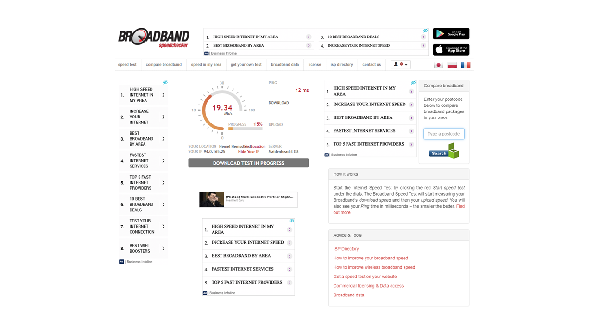
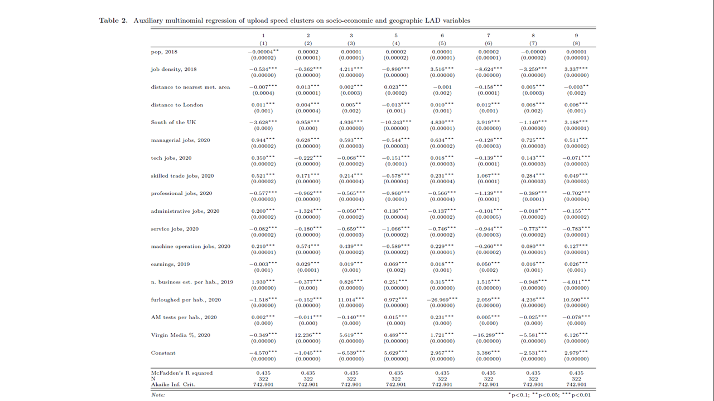

```{r, echo=FALSE, results=FALSE, include=FALSE}
library(tidyverse)
library(geojsonio)
library(rprojroot)
library(knitr)
library(stargazer)
library(nnet)

knitr::opts_chunk$set(echo = FALSE, message = F, warning = F) # By default, hide code; set to TRUE to see code
#knitr::opts_chunk$set(out.width = '100%', dpi=300) # Figure resolution and size

# This is the project path
path <- find_rstudio_root_file()

```

## Cite:

<br>
Budnitz, H., and E. Tranos (2021) Working from home and digital divides: resilience during the pandemic. *Annals of the AAG*. In press. [link](https://doi.org/10.1080/24694452.2021.1939647)
<br>
<br>
[etranos.info/post/rinr2021](https://etranos.info/post/rinr2021)


## Contents

- Introduction
- Experienced broadband speed data
- Analysis
- Conclusions

# Introduction

## WFH / Telecommuting
- From a niche means of accessing work to a widespread way of life
- From $5$% to $47$% in the UK [@ons2020; @ons2020lm2019]
- $37$% WFM in European April $2020$ 
- $60$% in Finland  [@eurofound2020]
- Almost $50$% in the US, $37$% could be permanently moved online [@brynjolfsson2020covid; @NBERw26948]

## WFH / Telecommuting
- WFH = economic resilience during Covid-19

- Capability to WFH:
  - occupations
  - quality digital infrastructure

- Spatial clustering and dependence

## Digital divides
- 1st level: availability and quality of internet connectivity

- 2nd level: skills to effectively utilise digital technologies

- 3rd level: returns of internet usage

- Cross-level interactions

## Our approach
- Intersection of digital and material divides

- Economic resilience of places as digital technologies became an essential
tool of productivity during the pandemic
<br>
<br>
**internet services + occupations $\Rightarrow$ WFM $\Rightarrow$ economic resilience**

## Our approach
- UK Local Authorities Districts (LAD) as a case study
- Quality of internet service: *experienced* internet speeds during the spring $2020$ lockdown
- Time-series clustering to create clusters of local authorities with similar temporal signatures of internet speeds
  - $\Rightarrow$ 1st level of digital divide
- Regress cluster membership against their socioeconomic and geographic characteristics 
  - $\Rightarrow$ how the 1st level of digital divide intersects with the 2nd and 3rd
 
# Data

## Experienced Broadband Speeds 
- *Experienced* vs. advertised internet speeds
- $\Uparrow$ internet demand \ usage $\Downarrow$ experienced internet speed
- [www.broadbandspeedchecker.co.uk/](https://www.broadbandspeedchecker.co.uk/)
- @riddlesden2014broadband & @nardotto2015unbundling
- Stream data, anonymised individual speed tests
- Upload speeds and the frequency of speed tests March to May $2020$
<br>
<br>
<center>
{width=40%}
</center>

---

```{r echo=FALSE, out.width='60%'}
path.image = paste0(path,"/paper/v2_taylor_francis/figures/time.var.plot2020.png")
knitr::include_graphics(path.image)
```

---

```{r echo=FALSE, out.width='60%'}
path.image = paste0(path,"/paper/v2_taylor_francis/figures/time.var.plot2019.png")
knitr::include_graphics(path.image)
```

## Experienced Broadband Speeds 
- An overall trend of increased testing from March to April and then a slight reduction from April to May in 2020, compared to less testing as Spring progresses in 2019

- $2019$ evening peak of testing, leisure activities, download speeds
- $2020$ **new morning peak** $\Rightarrow$ flatter hourly temporal profile

# Analysis

## Aggregation 
- Relatively scarce data to analyse as stream

- Composite week time series

- Mon-Friday, hourly $6:00$ -- $24:00$, excl. bank holidays

- $18$ hourly data points $x$ $5$ weekdays ($90$) for each local authority ($382$)

- Focus on upload speeds

## Time series clustering
- *Aim*: create clusters of local authorities with similar temporal signatures of internet speed

- Shape-based approach
- Match two separate time-series objects based on the similarity of their shapes 
- Distances between the shapes
- Simplicity: 
  - *k*-means
  - medoids, time-series objects with a minimal distance to all other cluster objects

---
```{r echo=FALSE, message=FALSE, results = "asis"}
path.clustersLADup <- paste(path, "./data/temp/LAD.cluster.up.csv", sep = "")

clustersLADup <- read_csv(path.clustersLADup)

# clustersLADup <- clustersLADup %>%
#   dplyr::rename('N. of LADs' = up.LADs,
#          'mean upload speed' = upMean,
#          'SD upload speed' = upSD,
#          'mean AM upload speed' = upAMmean)


clustersLADup <- clustersLADup %>%
  mutate(across(4:7, round, 0))

stargazer(clustersLADup[1:7],
          summary = F,
          font.size = "footnotesize",
          type = "html",
          header = F,
          digit.separator = ",",
          digit.separate = c(3,3),
          covariate.labels=c("Cluster",
                             "N. of LADs",
                             "LAD population",
                             "mean speed",
                             "SD speed",
                             "mean AM speed",
                             "mean PM speed"),
                             #"AM_slower",
                             #"SDtoMean"),
          rownames = F,
          no.space=TRUE,
          column.sep.width = "0pt",
          notes = "Note: All speed measures are upload speeds",
          title = "Upload speed cluster characteristics")
```

## Time series clustering

<small>

- Cluster 1: Medium sized mostly rural cluster; slow mean upload speeds; high workday temporal variation.

- Cluster 2: Small rural cluster; highest mean upload speeds; slowdown more in evening.

- Cluster 3: Medium sized mixed cluster; fast mean upload speeds; medium temporal variation.

- Cluster 4: Rural reference LAD; medium mean upload speeds; high temporal variation.

- Cluster 5: Small suburban cluster; fast mean upload speeds; slowdown more in evening.

- **Cluster 6: Large mixed cluster; slowest aggregate mean upload speeds; low workday temporal variation.**

- Cluster 7: Small suburban cluster; fast mean upload speeds; medium temporal variation.

- Cluster 8: Small mainly suburban cluster; slow mean upload speeds; high workday temporal variation.

- **Cluster 9: Large, more urban cluster; fast mean upload speeds; lowest workday temporal variation.**

</small>

---

```{r echo=FALSE, out.width='60%'}
path.image = paste0(path,"/paper/v2_taylor_francis/figures/map.up.clusters.png")
knitr::include_graphics(path.image)
```

## Post-clustering regression analysis
- Explain the characteristics of clusters
- How the 1st level of the digital divide intersects with the 2nd and 3rd?
- Multinomial logit regression: cluster membership against:
<small>

  - population
  - pop. and job density
  - distance to nearest met. area and to London, South of the UK dummy
  - % of managerial, tech, skilled trade, professional, administrative, leisure, machine operation jobs
  - earnings, n. business est. per hab.
  - % furloughed pop., 2020
  - AM broadband tests per hab.
  - % of Virgin Media connections

</small>

---

<center>
{width=120%}
</center>

---

```{r eval=FALSE, echo=FALSE, message=FALSE, results = "asis"}
path.LAs_Clusters <- paste0(path, "/data/temp/LAs_Clusters_k9.RData")
load(path.LAs_Clusters)


aux.up <- multinom(cluster.up ~ 
                     #pop16_64 + # non sign, while pop is
                     pop +
                     #pop.dens + 
                     job.dens2018 + # pop.dens is still insignificant when job.dens is excluded
                     distMet + distLondon + south +
                     managers + tech + skilled + prof + admin + caring + plant +
                     earnings + I(total.busi/pop) + I(furlough/pop) +
                     I(LAD.tests.am20/pop) + # non sensitive to addition of other tests pm
                     virgin
                   , data = data, 
                   trace = F) # to avoid messages 

# McFadden's R squared
aux.up.null <- multinom(cluster.up ~ 1, data = data)
r2.up <- 1-logLik(aux.up)/logLik(aux.up.null)

n.obs <- dim(aux.up$fitted.values)[1]

stargazer(aux.up, 
          type = "html",
          #type = "text",
          nobs = T,
          digits = 3,
          font.size = "footnotesize",
          covariate.labels=c(#"pop. 16-64, 2018",
            "pop, 2018",
            #"pop. density, 2018",
            "job density, 2018",
            "distance to nearest met. area",
            "distance to London",
            "South of the UK",
            "% of managerial jobs, 2020",
            "% of tech jobs, 2020",
            "% of skilled trade jobs, 2020",
            "% of professional jobs, 2020",
            "% of administrative jobs, 2020",
            "% of leisure jobs, 2020",
            "% of machine operation jobs, 2020",
            "earnings, 2019",
            "n. business est. per hab., 2019",
            "% furloughed pop., 2020",
            "n. of AM broadband tests per hab., 2020",
            "% of Virgin Media connections"),
          add.lines = list(c("McFadden's R squared",
                             round(r2.up[1],3), round(r2.up[1],3), round(r2.up[1],3),
                             round(r2.up[1],3), round(r2.up[1],3), round(r2.up[1],3),
                             round(r2.up[1],3), round(r2.up[1],3), round(r2.up[1],3)
                             , round(r2.up[1],3), round(r2.up[1],3)),
                           (c("N",
                              n.obs, n.obs, n.obs,
                              n.obs, n.obs, n.obs,
                              n.obs, n.obs, n.obs
                              , n.obs, n.obs))))


# ls()
# 
# str(aux.up)
# 
# summary(aux.up)

# tidy_model <- broom::tidy(aux.up)
# stargazer(tidy_model)

# stargazer(aux.up,
#           type = "text",
#           nobs = T,
#           digits = 3,
#           font.size = "footnotesize",
#           #float.env = "sidewaystable",
#           dep.var.caption = "",
#           title = "Auxiliary multinomial regression of upload speed clusters on socio-economic and geographic LAD variables",
#           header = F,
#           covariate.labels=c(#"pop. 16-64, 2018",
#                              "pop, 2018",
#                              #"pop. densuty, 2018",
#                              "job density, 2018",
#                              "distance to nearest met. area",
#                              "distance to London",
#                              "South of the UK",
#                              "managerial jobs, 2020",
#                              "tech jobs, 2020",
#                              "skilled trade jobs, 2020",
#                              "professional jobs, 2020",
#                              "administrative jobs, 2020",
#                              "service jobs, 2020",
#                              "machine operation jobs, 2020",
#                              "earnings, 2019",
#                              "n. business est. per hab., 2019",
#                              "furloughed per hab., 2020",
#                              "AM tests per hab., 2020",
#                              "Virgin Media \\%, 2020"),
#           add.lines = list(c("McFadden's R squared",
#                              round(r2.up[1],3), round(r2.up[1],3), round(r2.up[1],3),
#                              round(r2.up[1],3), round(r2.up[1],3), round(r2.up[1],3),
#                              round(r2.up[1],3), round(r2.up[1],3), round(r2.up[1],3)
#                              , round(r2.up[1],3), round(r2.up[1],3)),
#                            (c("N",
#                             n.obs, n.obs, n.obs,
#                             n.obs, n.obs, n.obs,
#                             n.obs, n.obs, n.obs
#                             , n.obs, n.obs))))
```
## Cluster 6 

- Workers are more likely to hold managerial, tech and professional jobs
- Least likely to be furloughed
- Slow and less reliable speeds
- High job density

## Clusters 6 and 9

- Although speeds were slow and not as reliable during the morning peak as in cluster 9, the skills that enabled telecommuting
also enabled **greater returns** from doing so ($\Downarrow$ furloughed)

- LADs in cluster 9 were able to benefit both from reliable internet connections and populations
able to work from home to capitalise on their digital infrastructure

- But **lower returns** in the pandemic $\Rightarrow$ greater numbers furloughed

## Being on the right side of digital divides

- Clusters 3, 7 and 9 are on the right side of the 1st layer of digital divide

- Internet resilience supports, but also frustrates urban economies in different geographies: 
  - $\Uparrow$ morning peak tests per capita run in cluster 6

- Being on the right side of the 2nd level digital divide had a **greater impact on economic resilience** (3rd level digital divide), than having quality internet connectivity 
  - $\Rightarrow$ cluster 1 and 6

# Conclusions

---

- Seven of our nine clusters had slower upload speeds in the morning than in the evening

- Evidence of widespread telecommuting and other daytime internet use (e.g. education)
which changed the temporal profile of internet activity throughout the UK

- Upload speeds have not previously been seen as integral to universal service, considering there has never before been such extreme demand for telecommuting and operations such as video calls

---

- Τelecommuting from the viewpoint of the complex web of digital divides

- Quality of internet infrastructure

- Places may depend upon good internet reliability and connectivity to achieve economic resilience in a period like the current pandemic

- Νot every place hosts individuals with the necessary *skills* and in *occupations* to effectively use the internet to telecommute


```{css eval=FALSE, echo=FALSE, message=FALSE}
.slide {
    height: 750px;
    overflow-y: auto !important;
}

# it aligns all the slides
# .reveal section {
#         text-align: left;
#     }

```

# References {.allowframebreaks}
